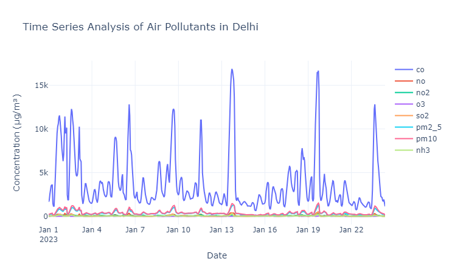
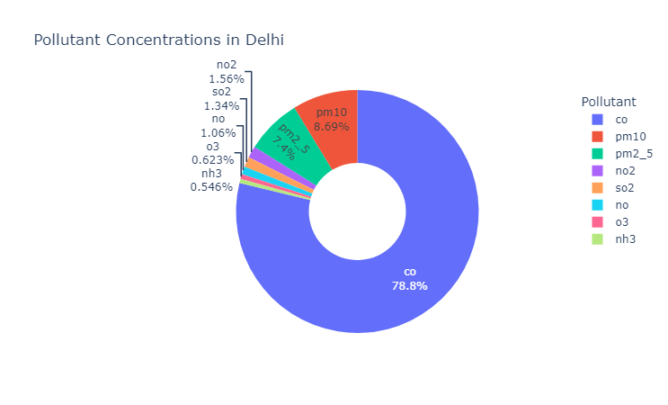
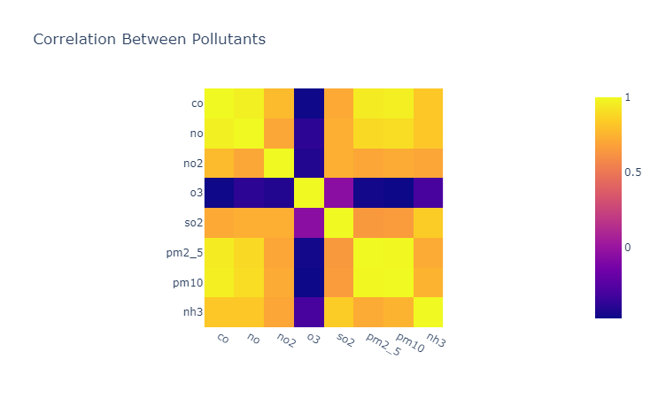

# Analysis Dashboard

This dashboard provides insights into air pollution analysis, with a focus on pollutants in Delhi. It contains three main analyses: Time Series Analysis, Pollutant Concentration, and a Heatmap of Pollutants. Each analysis is displayed based on the selected option, and the results help in understanding the behavior of different air pollutants.

## Analysis 1: Time Series Analysis

This section provides a time series analysis of air pollutants over a period in January.

### Summary:
- **CO levels** are substantially higher and more volatile than the other pollutants, indicating a major source of pollution from CO emissions during this period.
- **Spikes in PM10 and PM2.5** suggest particulate matter pollution during some specific events (e.g., fires, traffic, or weather conditions) on January 12 and January 19.
- **NO, NO2, O3, SO2, and NH3** contribute less to the overall pollution compared to CO and particulate matter.
- This time series analysis reveals that **CO and particulate matter (PM10 and PM2.5)** are the primary pollutants affecting Delhi’s air quality during this period, likely from vehicular emissions, industrial activity, or other sources of combustion.

## Analysis 2: Pollutant Concentration

This analysis shows the distribution of different pollutants in the air based on their concentration levels.

### Summary:
- **Carbon Monoxide (CO)** stands out as the largest single contributor, highlighting significant concerns about its sources (likely vehicles, industrial activities, or combustion).
- **Particulate matter (PM10 and PM2.5)** also contributes significantly to air quality issues, representing around **15.83%** of the total pollution.
- The other pollutants—**NO, NO2, SO2, O3, NH3**—are relatively minor contributors but still important from a regulatory and health perspective.
- In summary, **CO** is overwhelmingly the largest pollutant, followed by **PM10** and **PM2.5**. The presence of particulate matter indicates serious health implications, particularly with long-term exposure in urban areas like Delhi.

## Analysis 3: Heatmap of Pollutants

This heatmap displays the correlation between different pollutants, helping to identify relationships between them.

### Summary:
- **NO and NO2**, and **PM10 and PM2.5** show strong correlations, meaning they often increase or decrease together, likely due to common sources (traffic, combustion, etc.).
- **O3** behaves independently of most pollutants, as it is more likely affected by atmospheric reactions rather than direct emissions.
- The lack of correlation between **CO** and other pollutants could indicate that it comes from specific sources (like vehicles) that are distinct from other pollutants measured.
- This heatmap helps understand the relationships between various pollutants, aiding in identifying common sources and contributing factors to air quality issues in Delhi.

